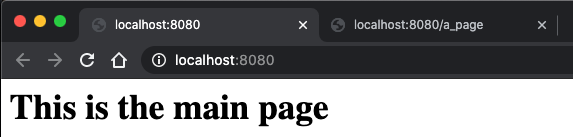
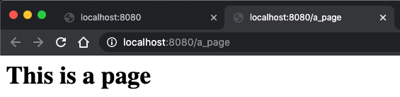

# Function objects and Thread programming
## Exercise 1
Jobb videre med sjakkbrett-løsningen deres fra Øving 5:
lag en klasse ChessBoardPrint som tar seg av utskrift (std::cout kallene) til terminalen
ChessBoardPrint må ha tilgang til ChessBoard instansen, for eksempel i main():
```c++
ChessBoard board;
ChessBoardPrint print(board);
```
- I konstruktøren til ChessBoardPrint skal dere definere funksjonsobjektene til ChessBoard instansen ved hjelp av lambda uttrykk.
- Utskriften av sjakkbrettet etter et sjakktrekk skal også foregå i ChessBoardPrint.
- Legg til et eget funksjonsobjekt i ChessBoard (for eksempel after_piece_move) som blir kjørt etter et trekk er utført. Definer dette funksjonsobjektet i ChessBoardPrint.

### Results
Here is the implementation of the ChessBoardPrint class.
```c++
class ChessBoardPrint {
  private:
      ChessBoard& board;
      function<void(ChessBoard &board)> printBoard;
  public:
      explicit ChessBoardPrint(ChessBoard &board) : board(board) {
          // setting function object to print entire board
          printBoard = [](ChessBoard &board) {
              char letters[] = "abcdefgh";
              for(int i = 7; i >= 0; i--) {
                  cout << letters[i];
                  for(int j = 0; j < 8; j++) {
                      cout << "|";
                      auto &piece = board.squares[i][j];
                      if(piece) {
                          cout << piece->symbol();
                      } else {
                          cout << " ";
                      }
                  }
                  cout << "|" << endl;
              }
              cout << "  1 2 3 4 5 6 7 8" << endl;
          };

          // Assigning the function objects for the board
          board.on_piece_move = [this](const ChessBoard::Piece &piece, const string &from, const string &to) {
              cout << piece.type() << " is moving from " << from << " to " << to << endl;
              printBoard(this->board);
          };
          board.on_removing_piece = [](const ChessBoard::Piece &piece, const string &square) {
              cout << piece.type() << " is being removed from " << square << endl;
          };
          board.on_check_mate = [](ChessBoard::Color losingColor) {
              if(losingColor == ChessBoard::Color::WHITE)
                  cout << "Black";
              else
                  cout << "White";
              cout << " won the game!" << endl;
          };
          board.on_invalid_piece_move = [](const ChessBoard::Piece &piece, const string &from, const string &to) {
              cout << "can not move " << piece.type() << " from " << from << " to " << to << endl;
          };
          board.on_missing_piece = [](const string &square) {
              cout << "no piece at " << square << endl;
          };
      }
  };
```
And here is an example of how the ChessBoard class calls its function objects:
```c++
 if(on_invalid_piece_move) on_invalid_piece_move(*piece_from, from, to);
```
The resulting print of this implementation is the same as in Assignment 5, but now it is much easier to replace the prints with a graphical interface etc.
```console
...
h| | | | | |♘| | |
g|♞| | | | | | | |
f| | | | | |♞| | |
e| |♚| | | | | |♔|
d| | | | | | | | |
c| | | | | | | | |
b| | | | | | | |♘|
a| | | | | | | | |
  1 2 3 4 5 6 7 8
black Knight is moving from h6 to g8
h| | | | | | | | |
g|♞| | | | | | |♘|
f| | | | | |♞| | |
e| |♚| | | | | |♔|
d| | | | | | | | |
c| | | | | | | | |
b| | | | | | | |♘|
a| | | | | | | | |
  1 2 3 4 5 6 7 8
black King is being removed from e8
white Knight is moving from f6 to e8
h| | | | | | | | |
g|♞| | | | | | |♘|
f| | | | | | | | |
e| |♚| | | | | |♞|
d| | | | | | | | |
c| | | | | | | | |
b| | | | | | | |♘|
a| | | | | | | | |
  1 2 3 4 5 6 7 8
White won the game!
```

## Exercise 2
Ta utgangspunkt i [example6](https://gitlab.com/ntnu-iini4003/examples6/blob/master/example6.cpp) og lag en enkel web-server som svarer på følgende GET forespørsler:   
- `GET / HTTP/1.1`
I en nettleser (http://localhost:8080) skal følgende tekst vises:
```console
Dette er hovedsiden
```
- `GET /en_side HTTP/1.1`
I en nettleser (http://localhost:8080/en_side) skal følgende tekst vises:
```console
Dette er en side
```
Andre forespørsler skal gi status koden `404 Not Found`

### Results
Im expaning the example code by creating the message for each client as follows:
```c++
if(message == "GET / HTTP/1.1") {
    writeToClient(connection, 200, "This is the main page");
    return;
}
if(message == "GET /a_page HTTP/1.1") {
    writeToClient(connection, 200, "This is a page");
    return;
}
writeToClient(connection, 404, "Error 404: page not found");
```

```c++
void writeToClient(const shared_ptr<Connection> &connection, int status, string content) {
    auto write_buffer = make_shared<boost::asio::streambuf>();
    ostream write_stream(write_buffer.get());

    string header;
    if(status == 404) {
        content = "<h1 style=\"color: red\">" + content + "</h1>\r\n";
        header = "HTTP/1.0 404 Not Found\r\n";
    } else {
        content = "<h1>" + content + "</h1>\r\n";
        header = "HTTP/1.0 " + std::to_string(status) + " OK\r\n";
    }
    header +=  "Content-Length: " + std::to_string(content.length()) + "\r\n"
               "Content-Type: text/html;\r\n"
               "charset=UTF-8\r\n"
               "\r\n";

    write_stream << header << content;
    async_write(connection->socket,
                *write_buffer,
                [this, connection, write_buffer](const boost::system::error_code &ec,
                                                 size_t) {
                    if(!ec)
                        handle_request(connection);
                });
}
```
The results of opening in a browser:    
    




