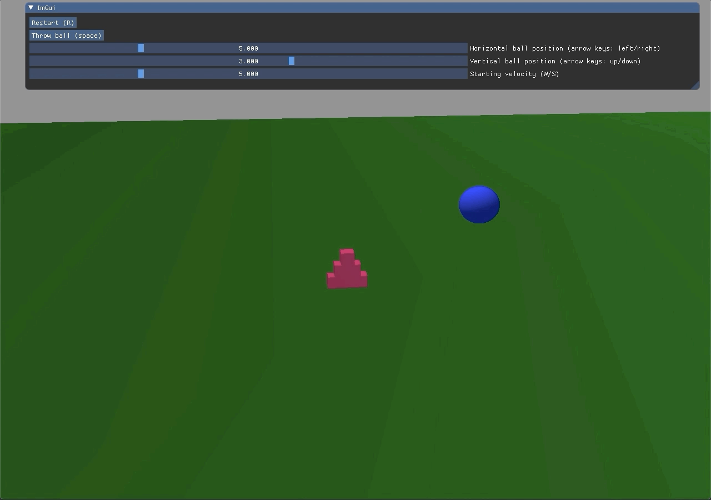
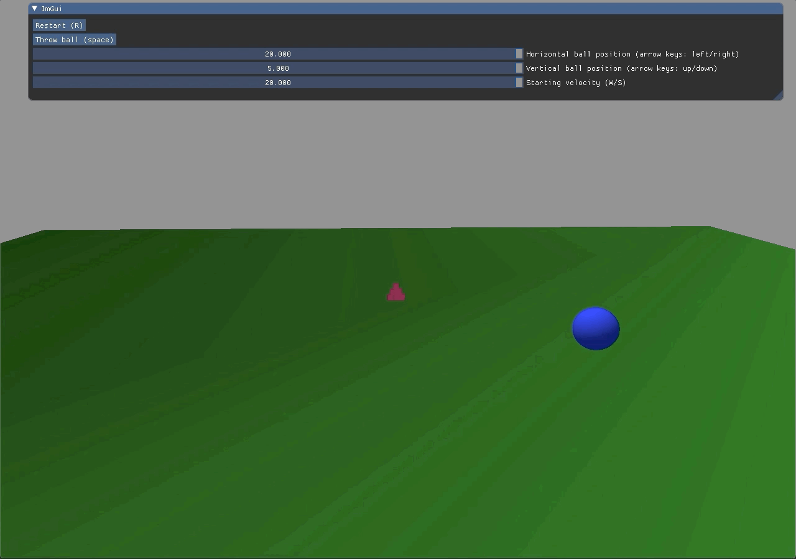
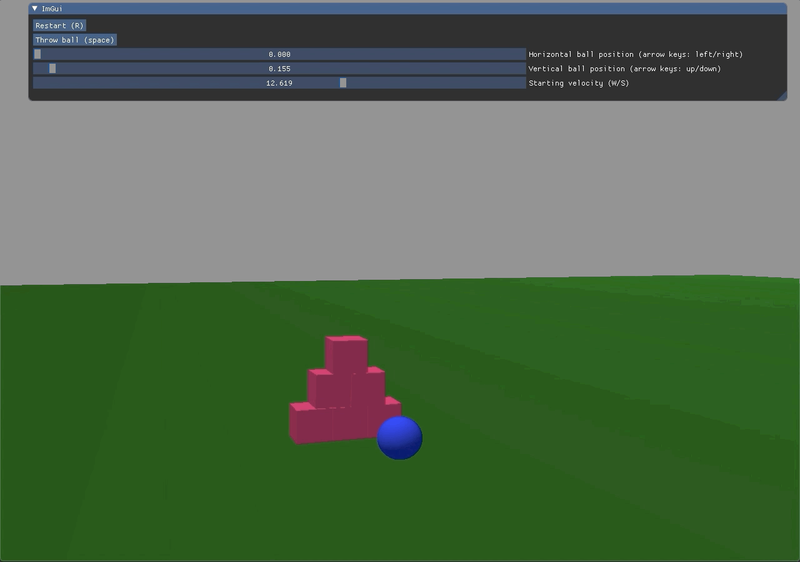

# Third party libraries
Base your assignment on the game at https://gitlab.com/ntnu-iini4003/game:
```shell script
git clone --recursive https://gitlab.com/ntnu-iini4003/game
```
#### Installing SFML, imgui, older OpenGL, and Bullet Physics
You might need to install the dependencies like his:

**Debian based distributions**   
`sudo apt-get install libsfml-dev libglm-dev libbullet-dev`

**Arch Linux based distributions**   
`sudo pacman -S sfml glm bullet`

**MacOS**  
`brew install sfml glm bullet`


Finish the implementation of the game where the goal is to drop the ball to knock down the boxes:
- Restart game
- Drop the ball
- Horisontal and vertical positioning of where the ball will be dropped.

In the example the following classes/functions needs to be altered:
- The class World with functions.
- The method Application::start(). Look for `// Implementation needed`.

You are free to expand or change the game in whatever way you want!
### Running the application (none of the buttons work, ball falls instantly)


# Results after implementation
Instead of just dropping the ball on another ball to make it hit the boxes, you can now give the ball an initial velocity. I also added keyboard shortcuts in addition the the *imGUI*, and separated the classes to separate files under *components*, and the third party libraries under *libs*.


### Adjusting initial position and velocity (with sliders and keyboard buttons)


### Throwing the ball and restarting


### A couple of throws


#### Current bugs/Future corrections
- The boxes currently keep their velocity when resetting, so resetting while they are moving is going to make them fall over instantly.
